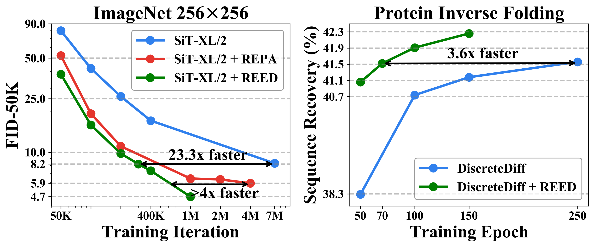
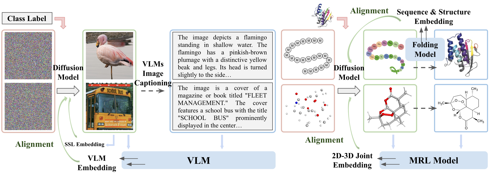

# Learning Diffusion Models with Flexible Representation Guidance

The repository contains the code for the `REED` method presented in the paper: *[Learning Diffusion Models with Flexible Representation Guidance](https://arxiv.org/pdf/2507.08980)*. `REED` presents a comprehensive framework for representation-enhanced diffusion model training, combining theoretical analysis, multimodal representation alignment strategies, an effective training curriculum, and practical domain-specific instantiations (image, protein sequence, and molecule). 





## Image Generation
For the class-conditional ImageNet $256\times 256$ benchmark, `REED` achieves a $23.3 \times$ training speedup over the original SiT-XL, reaching FID=8.2 in only 300K training iterations (without classifier-free guidance); and a $4 \times$ speedup over [REPA (Yu et.al, 2024)](https://arxiv.org/abs/2410.06940), matching its classifier-free guidance performance at 800 epochs with only 200 epochs of training (FID=1.80). The detailed code and instructions are in `image/`.

## Protein Sequence Design
For protein inverse folding, `REED` accelerates training by $3.6\times$ and yields significantly superior performance across metrics such as sequence recovery rate, RMSD and pLDDT. The detailed code and instructions are in `protein/`.

## Molecule Generation
For molecule generation, `REED` improves metrics such as atom and molecule stability, validity, energy, and strain on the challenging Geom-Drug datasets. The detailed code and instructions are in `molecule/`.

## Citation
If you find this work useful in your research, please cite:
```
@article{wang2025learning,
  title={Learning Diffusion Models with Flexible Representation Guidance},
  author={Chenyu Wang and Cai Zhou and Sharut Gupta and Zongyu Lin and Stefanie Jegelka and Stephen Bates and Tommi Jaakkola},
  journal={arXiv preprint arXiv:2507.08980},
  year={2025}
}
```
