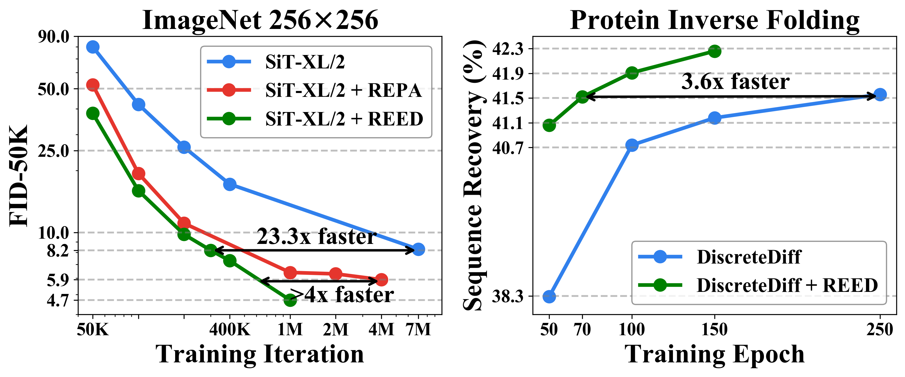
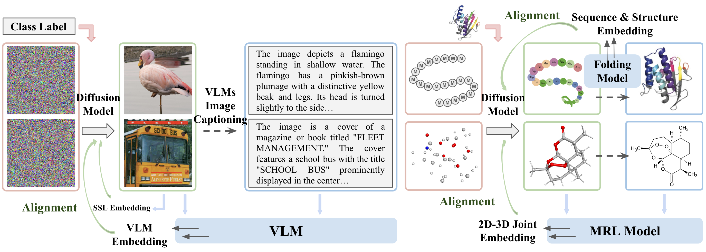

<div align="center">

<h1>Learning Diffusion Models with Flexible Representation Guidance | NeurIPS 2025</h1>

<div>
    <a href="https://chenyuwang-monica.github.io/" target="_blank">Chenyu Wang</a><sup>1,*</sup> | 
    <a href="https://homepage.zhouc.ai/" target="_blank">Cai Zhou</a><sup>1,*</sup> | 
    <a href="https://www.mit.edu/~sharut" target="_blank">Sharut Gupta</a><sup>1</sup> | 
    <a href="https://rafa-zy.github.io/" target="_blank">Zongyu Lin</a><sup>2</sup> |
    <a href="https://people.csail.mit.edu/stefje/" target="_blank">Stefanie Jegelka</a><sup>1,3</sup> |
    <a href="https://stephenbates19.github.io/index.html" target="_blank">Stephen Bates</a><sup>1</sup> |
    <a href="https://people.csail.mit.edu/tommi/tommi.html" target="_blank">Tommi Jaakkola</a><sup>1</sup>
</div>
<br>
<div>
    <sup></sup><sup>1</sup> MIT   <sup>2</sup> UCLA <sup>3</sup> TU Munich
</div>
<div>
    <sup>*</sup> Equal Contribution
</div>
<br>


[](https://arxiv.org/abs/2507.08980)
[](https://neurips.cc/virtual/2025/poster/117107)

The repository contains the code for the `REED` method presented in the paper: *[Learning Diffusion Models with Flexible Representation Guidance](https://arxiv.org/pdf/2507.08980) **(NeurIPS 2025)***. Check our project page [here](https://chenyuwang-monica.github.io/REED/)!


<div align="left"> 

## 📢 News
- [2025/10/12] We release the [project page](https://chenyuwang-monica.github.io/REED/).
- [2025/09/18] REED is accepted to [NeurIPS 2025](https://neurips.cc/virtual/2025/poster/117107)!
- [2025/07/12] Code is released!
- [2025/07/12] Paper is available on [arXiv](https://arxiv.org/abs/2507.08980)!

## Overview
`REED` presents a comprehensive framework for representation-enhanced diffusion model training, combining theoretical analysis, multimodal representation alignment strategies, an effective training curriculum, and practical domain-specific instantiations (image, protein sequence, and molecule). 





## Image Generation
For the class-conditional ImageNet $256\times 256$ benchmark, `REED` achieves a $23.3 \times$ training speedup over the original SiT-XL, reaching FID=8.2 in only 300K training iterations (without classifier-free guidance); and a $4 \times$ speedup over [REPA (Yu et.al, 2024)](https://arxiv.org/abs/2410.06940), matching its classifier-free guidance performance at 800 epochs with only 200 epochs of training (FID=1.80). The detailed code and instructions are in `image/`.

## Protein Sequence Design
For protein inverse folding, `REED` accelerates training by $3.6\times$ and yields significantly superior performance across metrics such as sequence recovery rate, RMSD and pLDDT. The detailed code and instructions are in `protein/`.

## Molecule Generation
For molecule generation, `REED` improves metrics such as atom and molecule stability, validity, energy, and strain on the challenging Geom-Drug datasets. The detailed code and instructions are in `molecule/`.

## Citation
If you find this work useful in your research, please cite:
```
@article{wang2025learning,
  title={Learning Diffusion Models with Flexible Representation Guidance},
  author={Chenyu Wang and Cai Zhou and Sharut Gupta and Zongyu Lin and Stefanie Jegelka and Stephen Bates and Tommi Jaakkola},
  journal={arXiv preprint arXiv:2507.08980},
  year={2025}
}
```
